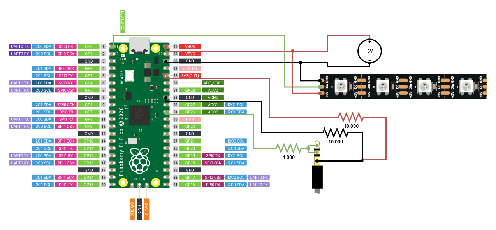

# Raspberry Pi Pico USB LED Controller

This project creates a uses a Raspberry Pi Pico to create an LED controller with a USB interface to PC.

## Supported Animations
- Solid
- Stream
- Scroll
- Pulse
- Spectrum Analyzer

## Prerequisites
### Pico C/C++ SDK
Install the [pico-sdk](https://github.com/raspberrypi/pico-sdk).
Instructions can be found in chapter 2 of [Getting Started with Raspberry Pi Pico](https://datasheets.raspberrypi.com/pico/getting-started-with-pico.pdf)

## Usage

To get started, download [PicoUsbLedStripClient.exe](https://github.com/Disciple153/PicoUsbLedStrip/releases/latest/download/PicoUsbLedStripClient.exe) and clone this repo or download the [SourceCode](https://github.com/Disciple153/PicoUsbLedStrip/zipball/main). 

### Flashing PicoUsbLedStripHost
In Constants.cs, change `LED_STRIP_LENGTH` to the number of LEDs in your LED strip.

- Navigate to PicoUsbLedStripHost/build
- Run `cmake .. && make`

Put Pico into USB Mass Storage Mode by holding the BOOTSEL buttton while plugging it in.

Paste PicoUsbLedStrip.uf2 onto the Pico.

### Running PicoUsbLedStripClient
With the Pico plugged into your PC, and run PicoUsbLedStripClient.exe:

```
PicoUsbLedStripClient.exe: PicoUsbLedStripClient.exe <DisplayMode> [-c <Colors>] [-l <LoopTime>]
    Send a command to the PicoUsbLedStripHost.

    DisplayModes:
        Solid:              Shows a static color or gradient.
        Pulse:              Shows colors while pulsing from minimum to maximum brightness over looptime.
        Stream:             Shows a static color or gradient without saving to flash memory. This is useful for streaming data to the PicoUsbLedStripHost.
        Scroll:             Scrolls colors across the LED strip with a period of looptime.
        SpectrumAnalyzer    Displays an audio spectrum analysis as brightness over the colors while the colors scroll.

    Options:
        -c  --colors    A comma delimited list of colors. Each color may be in hexadecimal or plaintext format (ex: green). Each color will fade into the next in a circular pattern.
        -l  --looptime  A 16 bit unsigned integer representing the number of milliseconds in an animation cycle. May be in decimal or hexadecimal format (ex 512: or 0x200)."
```

Example:

`$ PicoUsbLedStripClient.exe Scroll -c 8000FF,8000FF,green,green -l 0x8000`


## Wiring Diagram

Connecting the TRS (aux) cable is optional, and will enable the Spectrum Analyzer function.