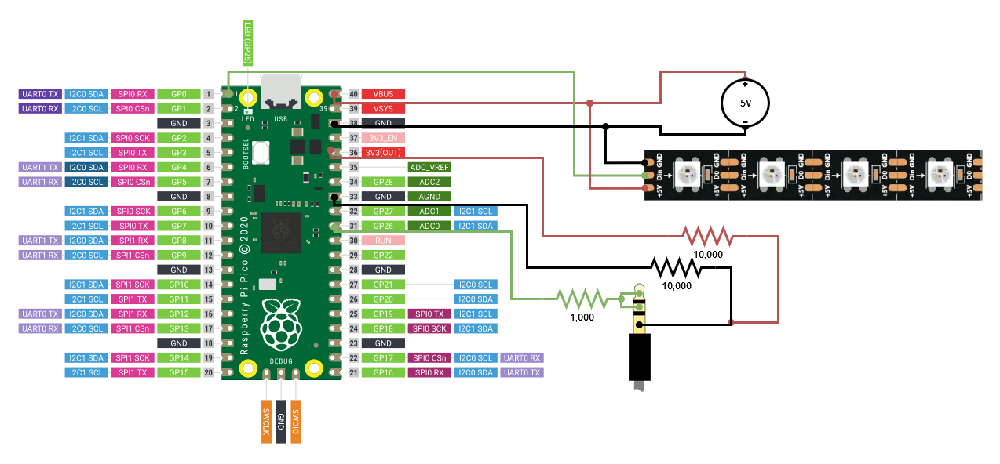

# Raspberry Pi Pico USB LED Controller

This project creates a uses a Raspberry Pi Pico to create an LED controller with a USB interface to PC.

## Supported Animations
- Solid
- Stream
- Scroll
- Pulse
- Spectrum Analyzer

## Prerequisites
### Pico C/C++ SDK
Install the [pico-sdk](https://github.com/raspberrypi/pico-sdk).
Instructions can be found in chapter 2 of [Getting Started with Raspberry Pi Pico](https://datasheets.raspberrypi.com/pico/getting-started-with-pico.pdf)

Install .NET. TODO finish the client program and include an exe.

## Usage

In Constants.cs, change `LED_STRIP_LENGTH` to the number of LEDs in your LED strip.

- Navigate to DeskDisplayHost/build
- Run `cmake .. && make`

Put Pico into USB Mass Storage Mode by holding the BOOTSEL buttton while plugging it in.

Paste deskdisplay.uf2 onto the Pico.

Plug the Pico into your PC, and run DeskDisplayClient.exe.
`DeskDisplayClient.exe [animation] -c [colors] -l [loopTime]`
- animation
    - Solid
    - Stream
    - Scroll
    - Pulse
    - Spectrum Analyzer
- colors
    - Comma seperated list of colors in text of hexadecimal format.
- looptime
    - The time in ms for one loop to be completed.
    - must be between 0x0000 and 0xFFFF.

## Wiring Diagram

Connecting the TRS (aux) cable is optional, and will enable the Spectrum Analyzer function.